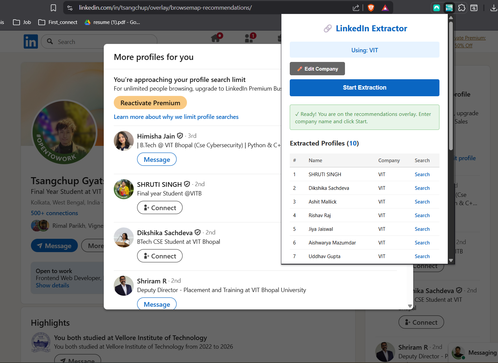

# LinkedIn Extractor

Because manually copying 50 names and Googling them individually is nobody's idea of a good time.

# Demo Video

## What It Does

- **Extracts profiles** from LinkedIn recommendations based on company name
- **Auto-generates search URLs** so Google does the heavy lifting
- **Filters for "Connect" users** only (because "Message" means you're already connected)
- **Exports to CSV/Excel** like a professional data scientist
- **Robust matching** handles company name chaos (Google, google, google.com, goo-gle... we got you)

## Why Use This?

LinkedIn Premium wants $40/month to help you network. This extension does it for free while you sip your coffee. Work smarter, not harder—automate the boring stuff and focus on actual networking.

## Installation

1. Download this repository (green button, you know the drill)
2. Open Chrome → `chrome://extensions/`
3. Flip the **Developer mode** switch (top-right corner)
4. Click **Load unpacked** → select the folder
5. Boom. You're operational.

## How to Use

1. Go to any LinkedIn profile (literally anyone)
2. Type the company name (Google, lusia.ai, whatever)
3. Hit **Start Extraction** and let it work
4. Visit more profiles—it keeps collecting automatically
5. Download your networking goldmine as CSV or Excel

## What's Next?

This is feature #1. More LinkedIn automation coming soon because repetitive tasks are the enemy of productivity.

---

## ☕ Support the Creator

If you find this extension useful, consider supporting us!  
Your contribution will help us publish this extension on the Chrome Web Store.

 [Buy Me a Coffee](https://buymeacoffee.com/ashirwad05)

**Pro tip:** Use responsibly. LinkedIn's watching, but so is your career growth. 🚀

## License

MIT License - Free to use and modify

---

*Note: This extension is for personal productivity and automation. Use responsibly and in accordance with LinkedIn's terms of service.*
